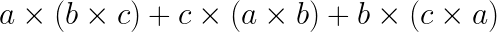
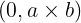

# Jacobi Identity

Here is the Jacobi identity:
    


This had better work for a quaternion cross product that return  Rev up the Jupyter notebook and see if my assertion is true.

Load the needed libraries.


```python
%%capture
%matplotlib inline
import numpy as np
import sympy as sp
import matplotlib.pyplot as plt
import math

# To get equations the look like, well, equations, use the following.
from sympy.interactive import printing
printing.init_printing(use_latex=True)
from IPython.display import display

# Tools for manipulating quaternions.
from Qs import *

from IPython.core.display import display, HTML, Math, Latex
display(HTML("<style>.container { width:100% !important; }</style>"))

# Print more of each cell, not just the last item.
from IPython.core.interactiveshell import InteractiveShell
InteractiveShell.ast_node_interactivity = "all"
```

Do this symbolically.


```python
a1, a2, a3, a4 = sp.symbols("a1 a2 a3 a4")
b1, b2, b3, b4 = sp.symbols("b1 b2 b3 b4")
c1, c2, c3, c4 = sp.symbols("c1 c2 c3 c4")
a = Q([a1, a2, a3, a4])
b = Q([b1, b2, b3, b4])
c = Q([c1, c2, c3, c4])

p1 = cross_q(a, cross_q(b, c))
p2 = cross_q(c, cross_q(a, b))
p3 = cross_q(b, cross_q(c, a))

p1p2p3 = add(p1, add(p2, p3)).simple_q()
print("Is the Jacobi identity true for quaternions? ", equal(p1p2p3, q0()))
print()

p1p2p3.print_state("Jacobi")

    Is the Jacobi identity true for quaternions?  True
    
    Jacobi
    (0, 0, 0, 0) 
```


Bingo, bingo. Why does it work? Like all functions in the Qs library, the cross_q function returns a _quaternion_ cross product, explicitly returning a zero in the scalar position because that is a property of a quaternion cross product. The coordinate-independent way to write a cross product is: $ \rm{cross\_q}(a, b) = (a b - b a) / 2 $. Here is a description of the function in the library.


```python
?cross_q

    Signature: cross_q(q_1: 'Q', q_2: 'Q', reverse: 'bool' = False) -> 'Q'
    Docstring:
    Convenience function, calling product with kind="odd".
    Called 'cross_q' to imply it returns 4 numbers, not the standard 3.
    
    Args:
        q_1: Q
        q_2: Q
        reverse: bool
    
    Returns: Q
    File:      ~/workspace/QM/docs/Qs.py
    Type:      function
```

One should not confuse the cross product with the product as the cross product is the anti-symmetric part of the product.
